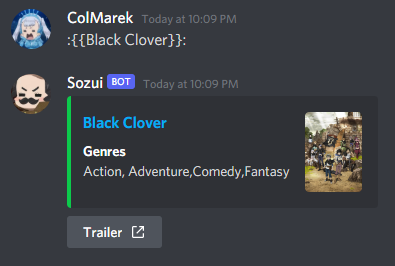

# Sozui


[](https://www.codacy.com/app/ColMarek/Sozui?utm_source=github.com&utm_medium=referral&utm_content=ColMarek/Sozui&utm_campaign=Badge_Grade)
[](https://snyk.io/test/github/ColMarek/Sozui?targetFile=package.json)

A Discord bot for anime/manga.

## Usage

You can link anime/manga using:

```
Anime (detailed)  ->  :{anime title}:
Anime             ->  :{{anime title}}:
Manga (detailed)  ->  :<manga title>:
Manga             ->  :<<manga title>>:
```

You can search for anime using:

```
!sozui search "Anime title"
```

Then click the corresponding reaction (emoji) number to post the anime's info.

React with `📹` on a response within 5m of it being sent to post the trailer (if it has one).





## Commands

Default prefix: `!sozui`

Use `!sozui help` to view a more updated list of commands.

**NB:** In a DM message, you don't need a prefix.

### Search

`!sozui search "Anime title"`

### Help

`!sozui help`

### Info

`!sozui info`
